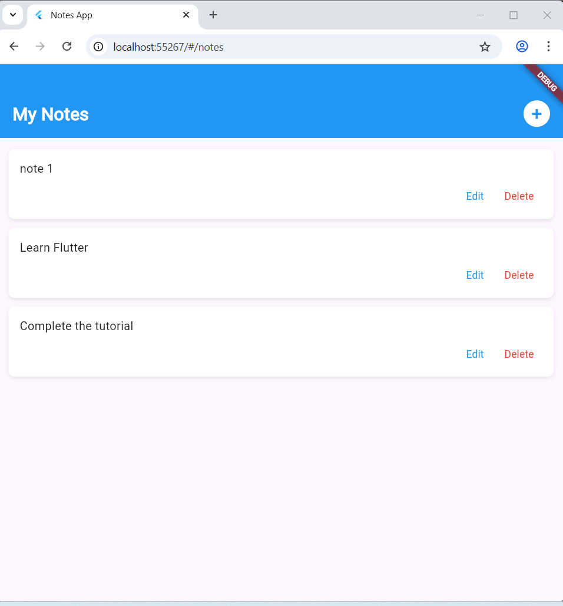

# Flutter Lab 1 - Notes App

A simple note-taking application built with **Flutter**.  
Allows you to add, edit, and delete notes.

# 1. Commands needed to create the Flutter project

## Check if Flutter is installed correctly
flutter doctor

## Create the project
flutter create notes_app

## Run the application
flutter run

# Screenshots

### Home Page

### Notes List Page

### Add Note Page

### Notes list with the new added note

## Clone the repository
git clone https://github.com/Nour4git/lab1_Flutter.git

